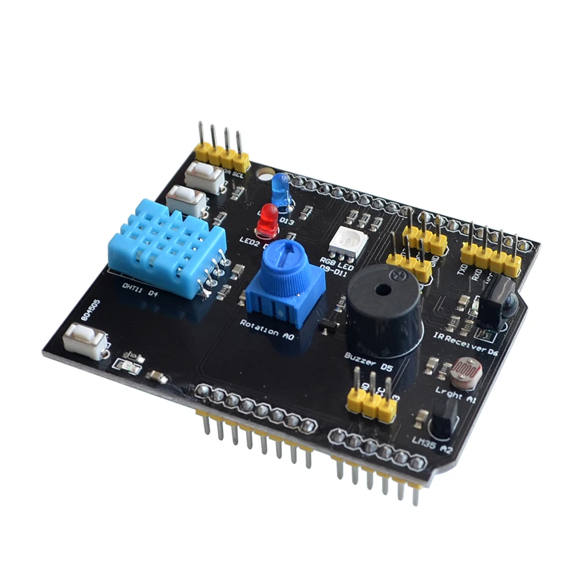

# 9-in-1 Expansion Sensor Board Arduino Uno

Code samples for 9-in-1 Multifunctional Expansion Board for Arduino UNO.

<picture>
  
</picture>

This repository contains code samples for demonstration purposes such as:
* Buzzer with Potentiometer
* DHT11 Sensor for Temperature and Humidity
* LED controlled by LDR Sensor
* RGB LED
* LED controlled by Switch
* Temperature Sensor LM35

Watch the implementation of this code on our YouTube channel:
https://www.youtube.com/@Roboticxps

To get your own 9-in-1 Expansion Board, visit our online store:
https://roboticx.ps/

Follow us on social media:

* Facebook: https://www.facebook.com/Roboticxps
* Instagram: https://www.instagram.com/roboticx.ps/
* YouTube: https://www.youtube.com/@Roboticxps
* LinkedIn: https://www.linkedin.com/company/roboticx/
